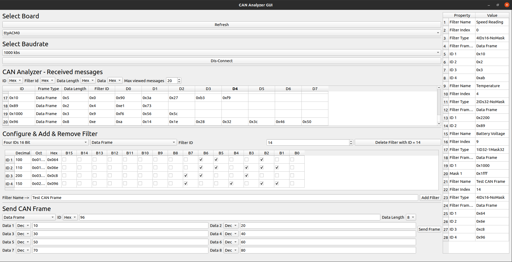

# CAN Analyzer
This repository hosts a simple CAN Analyzer project implemented using an STM32 NUCLEO development board and a Qt C++ graphical user interface (GUI). The project provides a user-friendly interface to interact with the CAN bus, allowing users to view CAN messages, add hardware filters to the STM32 board, and send CAN frames.

## Features
* **CAN Message Monitoring:** The GUI displays CAN messages in real-time, providing insights into the data flowing through the CAN bus.

* **Hardware Filter Configuration:** Users can add hardware filters to the STM32 board, enabling selective message reception.

* **CAN Frame Transmission:** This project allows users to send custom CAN frames, making it a suitable tool for testing and debugging CAN communication.